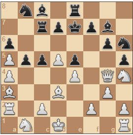

# Overview

This week I found a [wonderful post](https://www.r-bloggers.com/2022/07/programming-a-simple-minimax-chess-engine-in-r/) developing a mini-max algorithm in R which I thought was perfect for a "retweet" and discussion here in this optimization forum. This uses the [rchess](https://cran.r-project.org/web/packages/rchess/index.html) package.

Let's dig right in and start discussing what's up.


## Create a new chess game

```{r}
library(rchess)

chess_game <- Chess$new()
chess_game$moves()
chess_game$move("e4")
chess_game$turn()
chess_game$moves()
chess_game$move("a5")
plot(chess_game)

```


## Simulate 30 moves

```{r}
get_random_move <- function(chess_game) {
  valid_moves = chess_game$moves()
  choice = sample(valid_moves, size = 1)
  return(choice)
}
```


```{r}
# Set up a new game
chess_game <- Chess$new()

# Simulate just 50 turns (back and forth, white then black)
for(i in 1:30){
  chess_game$move(get_random_move(chess_game))
}
plot(chess_game)
```

```{r, echo=FALSE}

```


Some other helpful functions that could be used are below also.

```{r}
chess_game$game_over()
## [1] TRUE
chess_game$in_checkmate()
## [1] TRUE
chess_game$in_check()
## [1] TRUE

```


## Simulate a random game

```{r}

# Set up a new game
chess_game <- Chess$new()

# Perform random legal moves until the game ends in mate or draw
while (!chess_game$game_over()) {
  chess_game$move(get_random_move(chess_game))
  # chess_game$turn
}

# Plot the final position
plot(chess_game)
```

## Improving the chess engine

As the article referenced suggests, there are a couple things we'd like to do now,

<blockquote>

**Evaluation function**: implement a simple heuristic to evaluate individual positions based on the pieces on the board and the safety of the king
**Search function**: implement an algorithm that allows our engine to search through positions multiple moves ahead

</blockquote>

### Position & Material Evaluation Function

```{r}
# Position evaluation function
evaluate_position <- function(position) {
  # Test if black won
  if (position$in_checkmate() & (position$turn() == "w")) {
    return(-1000)
  }
  # Test if white won
  if (position$in_checkmate() & (position$turn() == "b")) {
    return(1000)
  }
  # Test if game ended in a draw
  if (position$game_over()) {
    return(0)
  }
  # Compute material advantage
  position_fen <- strsplit(strsplit(position$fen(), split = " ")[[1]][1], split = "")[[1]]
  white_score <- length(which(position_fen == "Q")) * 9 + 
                  length(which(position_fen == "R")) * 5 + 
                  length(which(position_fen == "B")) * 3 + 
                  length(which(position_fen == "N")) * 3 + 
                  length(which(position_fen == "P"))
  black_score <- length(which(position_fen == "q")) * 9 + 
                  length(which(position_fen == "r")) * 5 + 
                  length(which(position_fen == "b")) * 3 +
                  length(which(position_fen == "n")) * 3 +
                  length(which(position_fen == "p"))
  
  # Some grand masters say that board centrality is an advantage
  # Board centrality points here here ...
  
  # Evaluate king safety
  check_score <- 0
  if (position$in_check() & (position$turn() == "w")) 
    check_score <- -1
  if (position$in_check() & (position$turn() == "b"))
    check_score <- 1
  
  # Return final position score
  return(white_score - black_score + check_score)
}
# 
# chess_game <- Chess$new()
# chess_game$moves()
# chess_game$move("e4")
# chess_game$turn()
# chess_game$moves()
# chess_game$move("a5")
# chess_game$fen()
# plot(chess_game)

evaluate_position(chess_game)


```

## Minimax Search function

This code was happily stolen from the tutorial referenced. But in essence, this recursive function will take the current board and some depth. For the current players move, it will assess the array of possible moves. Decreasing depth it will pass in again. This continues until the depth is zero and returns the points from `evaluate_position`. Notice the exit condition is always the first section in a recursive function like this. Each move is gentle `undone` after stepping into it.

Once the collection of possible `next_move_scores` has been populated. For each possible player `white` or `black`, the `max` is returned for the white turn and `min` for the black.

```{r}
# Score position via minimax strategy
minimax_scoring <- function(chess_game, depth) {
  # If the game is already over or the depth limit is reached
  # then return the heuristic evaluation of the position
  if (depth == 0 | chess_game$game_over()) {
    return(evaluate_position(chess_game))
  }
  # Run the minimax scoring recursively on every legal next move, making sure the search depth is not exceeded
  next_moves <- chess_game$moves()
  next_move_scores <- vector(length = length(next_moves))
  for (i in 1:length(next_moves)) {
    chess_game$move(next_moves[i])
    next_move_scores[i] <- minimax_scoring(chess_game, depth - 1)
    chess_game$undo()
  }
  # White will select the move that maximizes the position score
  # Black will select the move that minimizes the position score
  if (chess_game$turn() == "w") {
    return(max(next_move_scores))
  } else {
    return(min(next_move_scores))
  }
}


# Select the next move based on the minimax scoring
get_minimax_move <- function(chess_game) {
  # Score all next moves via minimax
  next_moves <- chess_game$moves()
  next_move_scores <- vector(length = length(next_moves))
  for (i in 1:length(next_moves)) {
    chess_game$move(next_moves[i])
    # To ensure fast execution of the minimax function we select a depth of 1
    # This depth can be increased to enable stronger play at the expense of longer runtime
    next_move_scores[i] <- minimax_scoring(chess_game, 1)
    chess_game$undo()
  }
  # For white return the move with maximum score
  # For black return the move with minimum score
  # If the optimal score is achieved by multiple moves, select one at random
  # This random selection from the optimal moves adds some variability to the play
  if (chess_game$turn() == "w") {
    return(sample(next_moves[which(next_move_scores == max(next_move_scores))], size = 1))
  } else {
    return(sample(next_moves[which(next_move_scores == min(next_move_scores))], size = 1))
  }
}


```


```{r}
# Function that takes a side as input ("w" or "b") and plays 10 games
# The selected side will choose moves based on the minimax algorithm
# The opponent will use the random move generator
play_5_games <- function(minimax_player) {
  game_results <- vector(length = 5)
  for (i in 1:10) {
    chess_game <- Chess$new()
    while (!chess_game$game_over()) {
      if (chess_game$turn() == minimax_player) {
        # Selected player uses the minimax strategy
        chess_game$move(get_minimax_move(chess_game))
      } else {
        # Opponent uses the random move generator
        chess_game$move(get_random_move(chess_game))
      }
    }
    # Record the result of the current finished game
    # If mate: the losing player is recorded
    # If draw: record a 0
    if (chess_game$in_checkmate()) {
      game_results[i] <- chess_game$turn()
    } else {
      game_results[i] <- "0"
    }
  }
  # Print the outcome of the 10 games
  print(table(game_results))
}
```

```{r}
# play_10_games("w")
## game_results
##  b 
## 10
```

```{r}
# play_10_games("b")
## game_results
##  w 
## 10
```


# References

<cite> https://www.r-bloggers.com/2022/07/programming-a-simple-minimax-chess-engine-in-r/</cite>

