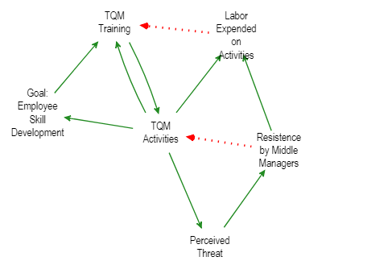

# Introduction

In this post we will explore how to effectively draw out `Causal Loop Diagrams` after a system has been designed. The plan is to:

1. Obtain a system
2. Extend the system with goals
3. Flow through the system
4. Analyze the flow

We will be leveraging the [Systems Thinker post](https://thesystemsthinker.com/causal-loop-construction-the-basics/) to obtain a thought out system, and we will add a couple `Goal` nodes and flow `Positive` or `Negative` directions to them. Once we flow through some positive and negative energy we will see how the system responds to achieving it's goal. This is **not system dynamics**. The purpose of this post is to loosely extend systems thinking and systems causal loop diagramming with network flows and utility theory to see how a goal is accomplished within a system's structure. The end-state for this will be a clear understanding of which system components are 1) primary drivers to the goal, 2) enablers to the goal, 3) edifying the system from it's goals (in the given structure), 4) deterring the system from it's goals (in the given structure).

## Obtain a system

We will be using a very simple system for this post. Training causing activities, causing threat perception from managers, limiting those activities. We will extend this by adding a simple goal **Employee Skill Development**.

```{r, echo=FALSE}

```


### Visualize the system


```{r}
#library(remotes)
#remotes::install_github("jarrod-dalton/causalloop")
```

```{r}
library("causalloop")
L <- CLD(from=c("TQM Training", 
                "TQM Activities",
                "TQM Activities",
                "Perceived Threat",
                "Resistence by Middle Managers",
                "TQM Activities"),
         to=c("TQM Activities",
              "TQM Training",
              "Perceived Threat",
              "Resistence by Middle Managers",
              "TQM Activities",
              "Goal: Employee Skill Development"), 
         polarity = c(1,
                      1,
                      1,
                      1,
                      -1,
                      1
           
         )
         )
# L$edges
plot(L)
```
Clearly we can see that increasing training will increase activities and increase the goal. But a side effect occurs with a perceived threat and action by middle managers. Let's see if we can better identify this through a network flow algorithm.

## Flow through the system

If we simulate 1000 units flowing through the system, how does it balance with the negative feedback loop from middle managers? How does it affect  the goal of the system?

```{r}

library(ggplot2)

simulate_flow <- function(L, n = 1000, normalize = TRUE, plot = TRUE){
  L$nodes$score = 1
  for(sim in 1:n){
    for(i in 1:nrow(L$edges)){
      # print(i)
      edge <- L$edges[i, ]
      
      # cat("Adding ", edge$polarity, " from ", edge$from, " to ",edge$to, ".\n")
      tgt_idx = which(L$nodes$node == edge$to)
      src_idx = which(L$nodes$node == edge$from)
      L$nodes$score[tgt_idx] = L$nodes$score[tgt_idx] + 
                                  L$nodes$score[src_idx] * edge$polarity
    }
  }
  
  if(normalize){
    # L$nodes$score = L$nodes$score / n
    L$nodes$score = L$nodes$score / sum(L$nodes$score)
  }
  
  if(plot){
    plt <- ggplot(L$nodes) +
            geom_col(aes(x=reorder(node, -score),y=score, fill=score))+
            scale_fill_gradient(low = "red", high = "green") +
            coord_flip() +
            theme_bw() +
            ggtitle("Systemic Behavior (Desire) Polarity Chart",
                    subtitle = "Red = Desire to Decay | Green = Desire to Grow") +
            labs(fill = "Score", x="Score", y = "Node")
    
  }
  else{
    plt <- ggplot()
  }
  
  list(nodes = L$nodes,
       plt = plt)
}

nodes <- simulate_flow(L, n = 1000, normalize = TRUE, plot=TRUE)
nodes$nodes
```

Okay, let's take a step back. What did we just do? With the following formula:

$$
balance(node_j) = \sum_{n=1}^{N}{\sum_{a=(i,j)\in N}{balance(node_j) + flow(i,j)}*polarity(i,j)} \: \forall j \in J\:nodes
$$
Note: The `j` is fixed, so the inner sum will only trigger for this specific node, then for all nodes.

This gives us a way to see how the flows are going to naturally navigate through the system. So once we accrue a flow balance for each node, we should normalize so all are compared equally. 

$$
balance(node_j) =  \frac{balance(node_j)}{\sum_{i=1}{balance(node_i)}} \:forall j \in J \: nodes 
$$

## Analyze the flow

```{r}
nodes$plt
```

A few remarks. 

1. TQM Activities desire to be decreased in favor of all the non-zero value nodes.
2. The goal is attained, but with 1/4 the cost/benefit due to the training being over 4x greater in value.
3. The real driver/desire is the resistance by middle managers.

This system isn't horrible, because the goal will eventually be attained with more effort; but it certainly isn't optimal.

## More Complex System

Let's consider some more realistic dynamics and see how this method weathers.

```{r}
library("causalloop")

L <- CLD(from=c("TQM Training", 
                "TQM Activities",
                "TQM Activities",
                "Perceived Threat",
                "Resistence by Middle Managers",
                "TQM Activities",
                "TQM Activities",
                "Labor Expended on Activities"),
         to=c("TQM Activities",
              "TQM Training",
              "Perceived Threat",
              "Resistence by Middle Managers",
              "TQM Activities",
              "Goal: Employee Skill Development",
              "Labor Expended on Activities",
              "TQM Training"), 
         polarity = c(1,
                      1,
                      1,
                      1,
                      -1,
                      1,
                      1,
                      -1
           
         )
         )
# L$edges
plot(L)
```

Notice we now have several feedback loops. Two balancing, one reinforcing.

```{r}
library(dplyr)
getLoops(L, S = 100, nsteps = 6)

```

```{r}

nodes <- simulate_flow(L, n = 600, normalize = TRUE, plot=TRUE)


nodes$nodes

```
Notice by adding the realistic consideration of labor expended on activities (plus the psychological affects of middle management resisting) it will balance the activities. Since the activities are already being balanced by middle management, this further balances the training themselves, because like all things, the system is connected.

```{r}
nodes$plt
```

This system is toxic. The goal is never attained, activities go down, but there is an interesting desire within the system to decrease labor and increase  training. However, through resistance the main efforts of the system are not accomplished. 

## Final Scenario

What if the goal itself reinforced the training (after all, good work does pay off with rewards)? what if the resistance from managers started to increase labor on the training themselves (after a while, people get tired)?

```{r}
library("causalloop")

L <- CLD(from=c("TQM Training", 
                "TQM Activities",
                "TQM Activities",
                "Perceived Threat",
                "Resistence by Middle Managers",
                "TQM Activities",
                "TQM Activities",
                "Labor Expended on Activities",
                "Goal: Employee Skill Development",
                "Resistence by Middle Managers"),
         to=c("TQM Activities",
              "TQM Training",
              "Perceived Threat",
              "Resistence by Middle Managers",
              "TQM Activities",
              "Goal: Employee Skill Development",
              "Labor Expended on Activities",
              "TQM Training",
              "TQM Training",
              "Labor Expended on Activities"), 
         polarity = c(1,
                      1,
                      1,
                      1,
                      -1,
                      1,
                      1,
                      -1,
                      1,
                      1
           
         )
         )
# L$edges
plot(L)


```

Now we have a reward signal from the goal back into training. Let's see how this changes things.

```{r}
nodes <- simulate_flow(L, n = 500, normalize = TRUE, plot=TRUE)
nodes$plt
```

Again this system is not constructive. The goal will diminish over time. The desire to decrease activities and increase training is outweighed by threats, labor, and resistance.

This is Systems Thinking and provides a framework to redesign our systems w/o any need for Systems Dynamics.


# References

[1] https://thesystemsthinker.com/causal-loop-construction-the-basics/

[2] https://rdrr.io/github/jarrod-dalton/causalloop/man/plot.CLD.html


